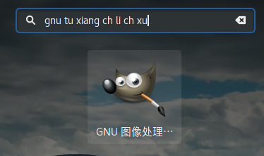

# Pinyin Search
Pinyin Search is a GNOME Shell extension that introduces direct pinyin support
to app search. It also introduces some other enhancements to app search, and
you're likely to like them.

This version of Pinyin Search is compatible with GNOME 3.24.2. I encourage you
to test it against different versions of GNOME Shell and report whether it 
works.

Current version: 1. Note that this is an early version, it's likely to break
your GNOME desktop. Don't hesitate to report any bugs if that's the case.



## Features
* Pinyin Match: `软件` -> `ruanjian`, `ruan jian`, `ru ji`, `rj`, etc.
* First-char Match: `Avahi Zeroconf` -> `a z`.
* Whitespace Ignorance: `Avahi Zeroconf` -> `az`.
* In-word Match: `Emacs` -> `acs`.

## Known Problems
* Too wide range of apps matched: the matching algorithm is too simple, but
  this project is too young after all.
* Some apps are not matched: more investigations needed.

Pull requests welcome!

## Installation
This extension is not yet published to 
[GNOME Shell Extensions hub](https://extensions.gnome.org/),
but you can manually set it up for your beloved GNOME desktop.

```bash
git clone https://github.com/ksqsf/pinyinsearch ~/.local/share/gnome-shell/extensions/pinyinsearch@ksqsf.moe
```
Enable it with GNOME Tweak Tool or through GNOME Extensions.

## Customization
`_PinyinSearch.pinyin_search` in `extension.js`.

## License
MIT-style.

## Author
Made with ♥ by [ksqsf](https://ksqsf.moe).

`ziHansFreq.js` was authored by [hotoo](https://hotoo.me/), with modifications
by ksqsf.
